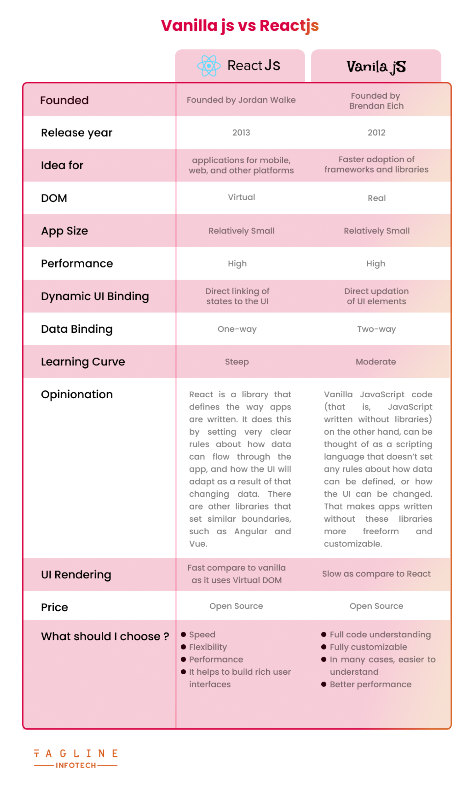

# Getting Started

## What is React?

React is a free and open-source front-end JavaScript library for building user interfaces based on UI components. It is maintained by Meta and a community of individual developers and companies.

## Vanila JS vs React JS

## Fun Functions 

Not really next-gen JavaScript, but also important: JavaScript array functions like map() , filter() , reduce()  etc.

The following page gives a good overview over the various methods you can use on the array prototype - feel free to click through them and refresh your knowledge as required: 
https://developer.mozilla.org/en-US/docs/Web/JavaScript/Reference/Global_Objects/Array

Particularly important in this course are:

    map()  => https://developer.mozilla.org/en-US/docs/Web/JavaScript/Reference/Global_Objects/Array/map
    find()  => https://developer.mozilla.org/en-US/docs/Web/JavaScript/Reference/Global_Objects/Array/find
    findIndex()  => https://developer.mozilla.org/en-US/docs/Web/JavaScript/Reference/Global_Objects/Array/findIndex
    filter()  => https://developer.mozilla.org/en-US/docs/Web/JavaScript/Reference/Global_Objects/Array/filter
    reduce()  => https://developer.mozilla.org/en-US/docs/Web/JavaScript/Reference/Global_Objects/Array/Reduce?v=b
    concat()  => https://developer.mozilla.org/en-US/docs/Web/JavaScript/Reference/Global_Objects/Array/concat?v=b
    slice()  => https://developer.mozilla.org/en-US/docs/Web/JavaScript/Reference/Global_Objects/Array/slice
    splice()  => https://developer.mozilla.org/en-US/docs/Web/JavaScript/Reference/Global_Objects/Array/splice